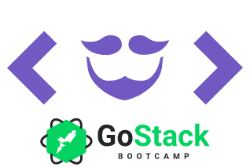

<h1 align="center">
    
    <br>
    GoBarber API
</h1>

<h4 align="center">
  A barber scheduling app that allows users to schedule an appointment with his favorite barber and shows to the barber his agenda for the day.
</h4>

<p align="center">
  <a href="https://ambegossi.com">
    
  </a>

  

  

  <a href="https://github.com/ambegossi/gobarber-api/commits/master">
    
  </a>

  <a href="https://github.com/ambegossi/gobarber-api/issues">
    
  </a>

  <a href="https://github.com/ambegossi/gobarber-api/blob/master/LICENSE.md">
  
  </a>

  <a href="https://github.com/ambegossi/gobarber-api/stargazers">
    
  </a>
</p>

<p align="center">
  <a href="https://www.codacy.com/manual/ambegossi/gobarber-api?utm_source=github.com&amp;utm_medium=referral&amp;utm_content=ambegossi/gobarber-api&amp;utm_campaign=Badge_Grade">
    
  </a>
</p>

<p align="center">
  <a href="#about">About</a>&nbsp;&nbsp;&nbsp;|&nbsp;&nbsp;&nbsp;
  <a href="#rocket-technologies">Technologies</a>&nbsp;&nbsp;&nbsp;|&nbsp;&nbsp;&nbsp;
  <a href="#information_source-how-to-use">How To Use</a>&nbsp;&nbsp;&nbsp;|&nbsp;&nbsp;&nbsp;
  <a href="#memo-license">License</a>
</p>

## About

Project developed at the [Rocketseat GoStack Bootcamp 🚀👨🏻‍🚀](https://rocketseat.com.br/gostack)

## :rocket: Technologies

- [Node.js][nodejs]
- [Express](https://expressjs.com/)
- [nodemon](https://nodemon.io/)
- [Sucrase](https://github.com/alangpierce/sucrase)
- [Docker](https://www.docker.com/docker-community)
- [Sequelize](http://docs.sequelizejs.com/)
- [PostgreSQL](https://www.postgresql.org/)
- [node-postgres](https://www.npmjs.com/package/pg)
- [Redis](https://redis.io/)
- [MongoDB](https://www.mongodb.com/)
- [Mongoose](https://mongoosejs.com/)
- [JWT](https://jwt.io/)
- [Multer](https://github.com/expressjs/multer)
- [Bcrypt](https://www.npmjs.com/package/bcrypt)
- [Youch](https://www.npmjs.com/package/youch)
- [Yup](https://www.npmjs.com/package/yup)
- [Bee Queue](https://www.npmjs.com/package/bcrypt)
- [Nodemailer](https://nodemailer.com/about/)
- [date-fns](https://date-fns.org/)
- [Sentry](https://sentry.io/)
- [DotEnv](https://www.npmjs.com/package/dotenv)
- [VS Code][vc] with [EditorConfig][vceditconfig] and [ESLint][vceslint]

## :information_source: How To Use

To clone and run this application, you'll need [Git](https://git-scm.com), [Node.js v10.16][nodejs] or higher + [Yarn v1.13][yarn] or higher installed on your computer. From your command line:

```bash
# Clone this repository
$ git clone https://github.com/ambegossi/gobarber-api

# Go into the repository
$ cd gobarber-api

# Install dependencies
$ yarn

# Run the app
$ yarn dev
```

## :memo: License

This project is under the MIT license. See the [LICENSE](LICENSE.md) for more information.

---

Made with ♥ by Anderson Begossi :wave: [Get in touch!](https://www.linkedin.com/in/anderson-begossi-b5065a130)

[nodejs]: https://nodejs.org/
[yarn]: https://yarnpkg.com/
[vc]: https://code.visualstudio.com/
[vceditconfig]: https://marketplace.visualstudio.com/items?itemName=EditorConfig.EditorConfig
[vceslint]: https://marketplace.visualstudio.com/items?itemName=dbaeumer.vscode-eslint
